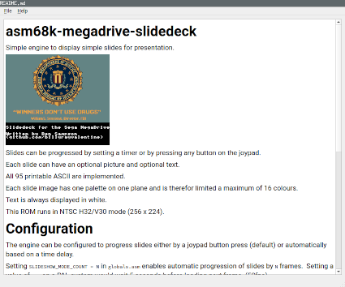

# MKV - Markdown Viewer
A very simple PySide6 app to view Markdown using the power of QT6.

Ever wanted a simple app just to validate and view your Markdown before you
commit it for all to see?  Well I did, so I wrote this initially in about half a
day.

Known to work with:

Python 3.9

PySide6 6.4.0.1

# Install
Install the pip package ```PySide6```

And run:
```python3.9 mkv.py```

# Usage
```shell
usage: mkv.py [-h] [-d {CRITICAL,ERROR,WARNING,INFO,DEBUG}] [file]

MKV - MarkDownViewer

positional arguments:
  file                  file to open

optional arguments:
  -h, --help            show this help message and exit
  -d {CRITICAL,ERROR,WARNING,INFO,DEBUG}, --debug {CRITICAL,ERROR,WARNING,INFO,DEBUG}
                        debug level
```

## Mouse and Key Bindings
The read-only mode QTextEdit key and mouse bindings can be used
(https://doc.qt.io/qt-6/qtextedit.html#read-only-key-bindings)

i.e.

| Keypresses | Action                                                        |
| ---------- | ------------------------------------------------------------- |
| Up         | Moves one line up.                                            |
| Down       | Moves one line down.                                          |
| Left       | Moves one character to the left.                              |
| Right      | Moves one character to the right.                             |
| PageUp     | Moves one (viewport) page up.                                 |
| PageDown   | Moves one (viewport) page down.                               |
| Home       | Moves to the beginning of the text.                           |
| End        | Moves to the end of the text.                                 |
| Alt+Wheel  | Scrolls the page horizontally (the Wheel is the mouse wheel). |
| Ctrl+Wheel | Zooms the text.                                               |
| Ctrl+A     | Selects all text.                                             |

# Screenshot

